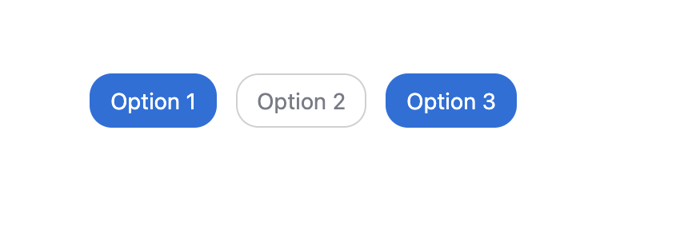

# Chips

A React Native component library to showcase chip selection. Easily allow users to select one or multiple options from a set of visually appealing chips.

## Features

- **Single or Multi-select**: Support for both single and multiple chip selection.
- **Customizable**: Style chips, text, and even provide custom chip templates.
- **Horizontal or Vertical Layout**: Display chips in a scrollable row or wrap to multiple lines.
- **Flexible Data**: Works with any array of objects, with configurable keys for label and value.

---


## Demo

Below is an example of how the chips look in multi-select mode:


<sub>_Add your own screenshot at `assets/demo-chips.png`_</sub>


---

## Usage

```tsx
import { Chips } from '@your-org/chips';

const options = [
  { text: 'Apple', value: 'apple' },
  { text: 'Banana', value: 'banana' },
  { text: 'Cherry', value: 'cherry' },
];

<Chips
  options={options}
  value={selectedOptions}
  onChange={setSelectedOptions}
  multiSelect={true}
  label="Select your favorite fruits"
  template="Outline"
/>
```

---

## Props

### `<Chips />`

| Prop                | Type                                               | Default         | Description                                                                                   |
|---------------------|----------------------------------------------------|-----------------|-----------------------------------------------------------------------------------------------|
| `options`           | `Record<string, unknown>[]`                        | **Required**    | Array of option objects to display as chips.                                                  |
| `value`             | `Record<string, unknown>[]`                        | `[]`            | Array of selected option objects.                                                              |
| `multiSelect`       | `boolean`                                          | `true`          | Allow multiple chips to be selected.                                                           |
| `valueKey`          | `string`                                           | `'value'`       | Key in option object for the chip value.                                                       |
| `textKey`           | `string`                                           | `'text'`        | Key in option object for the chip label.                                                       |
| `label`             | `string`                                           | `undefined`     | Optional label to display above the chips.                                                     |
| `template`          | `Template`                                         | `Outline`       | Visual style of the chips. See [Templates](#templates) below.                                  |
| `chipContentStyle`  | `ViewStyle`                                        | `undefined`     | Style for the chip content.                                                                    |
| `chipInnerWrapper`  | `ViewStyle`                                        | `undefined`     | Style for the inner wrapper of each chip.                                                      |
| `chipWrapperStyle`  | `ViewStyle`                                        | `undefined`     | Style for the wrapper containing all chips.                                                    |
| `baseTextColorStyle`| `TextStyle`                                        | `undefined`     | Style for the chip text.                                                                       |
| `onChange`          | `(selectedOptions, option, isSelected) => void`    | `undefined`     | Callback when selection changes.                                                               |
| `customTemplate`    | `(option, isSelected) => React.ReactNode`          | `undefined`     | Render a custom chip template.                                                                 |
| `horizontalScroll`  | `boolean`                                          | `false`         | If true, chips are displayed in a horizontal scroll view.                                      |
| `chipContainerStyle`| `ViewStyle`                                        | `undefined`     | Style for the outer container of the chips.                                                    |

### `<Chip />` (used internally)

| Prop                | Type                                               | Default         | Description                                                                                   |
|---------------------|----------------------------------------------------|-----------------|-----------------------------------------------------------------------------------------------|
| `option`            | `Record<string, unknown>`                          | **Required**    | The option object for this chip.                                                               |
| `label`             | `string | number | boolean`                      | **Required**    | The label to display.                                                                         |
| `selected`          | `boolean`                                          | **Required**    | Whether this chip is selected.                                                                 |
| `multiSelect`       | `boolean`                                          | **Required**    | Whether multi-select is enabled.                                                               |
| `template`          | `Template`                                         | `Outline`       | Visual style of the chip.                                                                      |
| `chipContentStyle`  | `ViewStyle`                                        | `undefined`     | Style for the chip content.                                                                    |
| `chipInnerWrapper`  | `ViewStyle`                                        | `undefined`     | Style for the inner wrapper.                                                                   |
| `baseTextColorStyle`| `TextStyle`                                        | `undefined`     | Style for the chip text.                                                                       |
| `onSelect`          | `(option) => void`                                 | **Required**    | Called when chip is selected.                                                                  |
| `onDeselect`        | `(option) => void`                                 | **Required**    | Called when chip is deselected.                                                                |
| `customTemplate`    | `(option, selected) => React.ReactNode`            | `undefined`     | Render a custom chip template.                                                                 |
| `chipContainerStyle`| `ViewStyle`                                        | `undefined`     | Style for the chip container.                                                                  |

---

## Templates

The `template` prop controls the visual style of the chips. Available values:

- `Outline`: Default outlined chip.
- `Primary`: Filled with primary color when selected.
- `Secondary`: Transparent background, colored text.
- `Clear`: No border, colored background when selected.
- `OutlineSolidSelection`: Outlined when unselected, solid when selected.

---

## Customization

You can fully customize the appearance and behavior of chips using the style and template props, or by providing a `customTemplate` function to render your own chip UI.

---

## License

MIT
